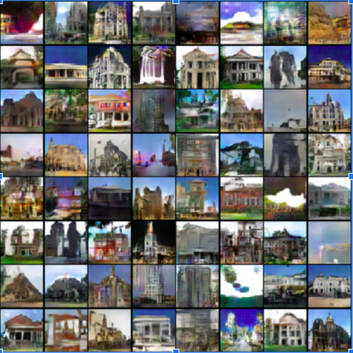

# Exploring-Architectural-Styles-with-GANs
CS464 Machine Learning Term Project

Team Members
1. Anar Huseynov 
2. Bahadir Durmaz
3. Doren Calliku
4. Ismayil Mammadov
5. Ufuk Turker

# Description
Our task is to create architectural pictures which are not skewed, or perceptually troubling, based on previously images. In this project we are experimenting on GAN architectures to create some meaningful results related to architectural styles. Having taken the algorithm from Goodfellow et al.’s paper of 2014, we have gone through different implementations to find which one fits best our purposes. 
We did not have to create the algorithm from scratch - we just worked on making the parts work. First we dealt with preprocessing of the data, as our data did not have the parameters the models makes use of. After that we tried to build up the ground truth by creating a Vanilla GAN which makes use of Multilayer perceptron structure. We had some difficulties with it. After a while we passed to CNN GAN. Here we implemented the Generator and Discriminator using Convolutional Neural Network as architectural bricks. After these steps, still the pictures did not look as well as we expected - so we tuned the parameters of the models.
The results have a steady increase of improvement, still we understood that GANs can come with really skewed images and still pass the discriminator. So, out of the pictures created there are a small amount of pictures which are useful, but their resolution is still low. 

